# Medkit

It's a Pharmacy application that help you in curing basic symptoms and diseases with medicines available in your home.

# How to Run Code
Clone or download the repo and place it anywhere in your computer. Open the folder in Android Studio or VS Code. Make sure that you have flutter SDK already installed. Type the command in terminal:

"flutter pub get"

After the command is run successfully you can run the app on real device or on emulator by pressing the Play button in Android Studio or by pressing F5 in VS Code.

# Features
## Doctor's Panel
A doctor can perform the following features for now:

1. Add Medicine/Disease

2. View Medicine/Disease

3. Update Medicine/Disease

4. Delete Medicine/Disease

5. Update profile

## Patient's Panel
A patient can perform the following features for now:

1. View Medicine/Disease

2. View Doctor's profile for contact

# Screen Shots

## Welcome and User Type
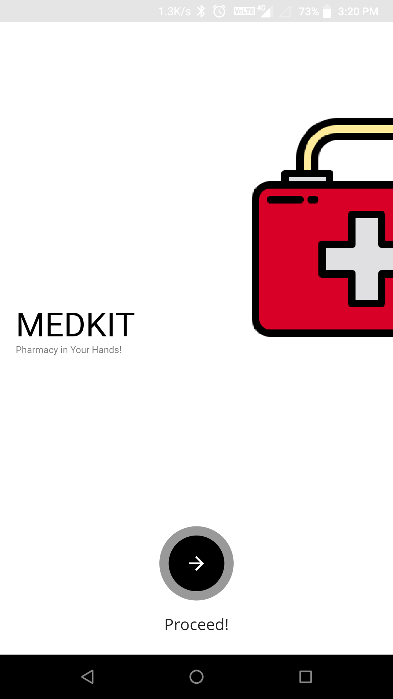 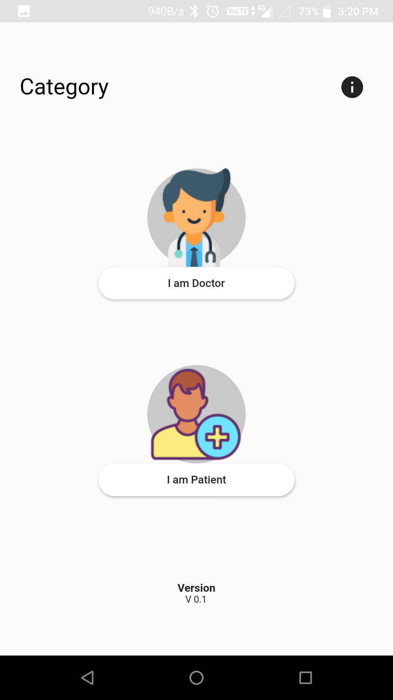 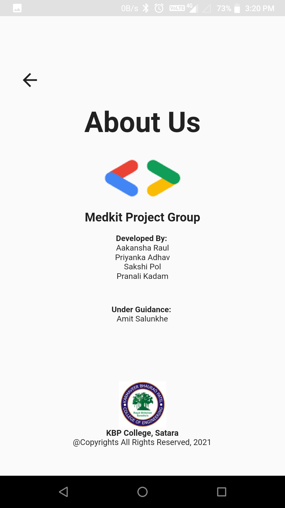

## Doctor Part
 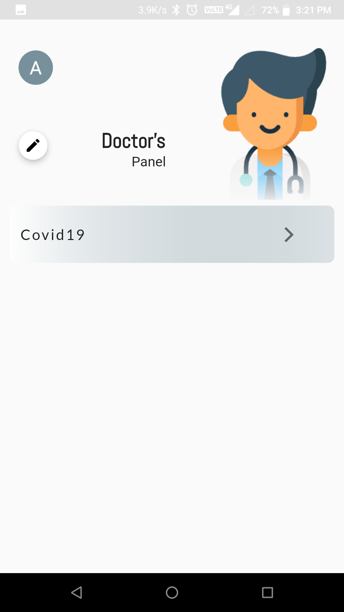 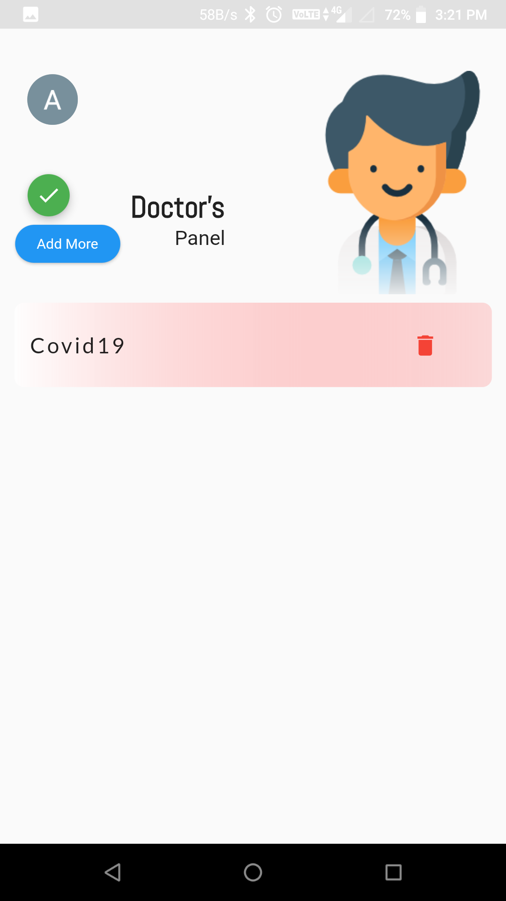 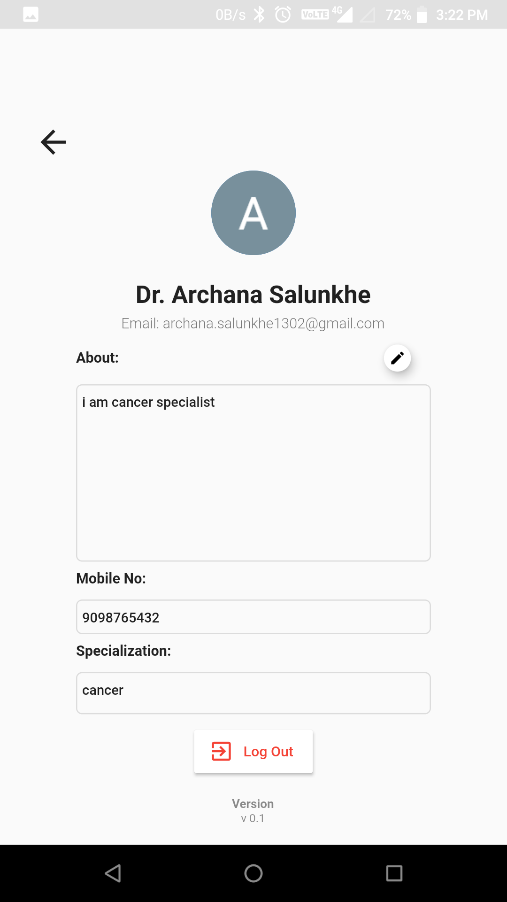

## Patient Part
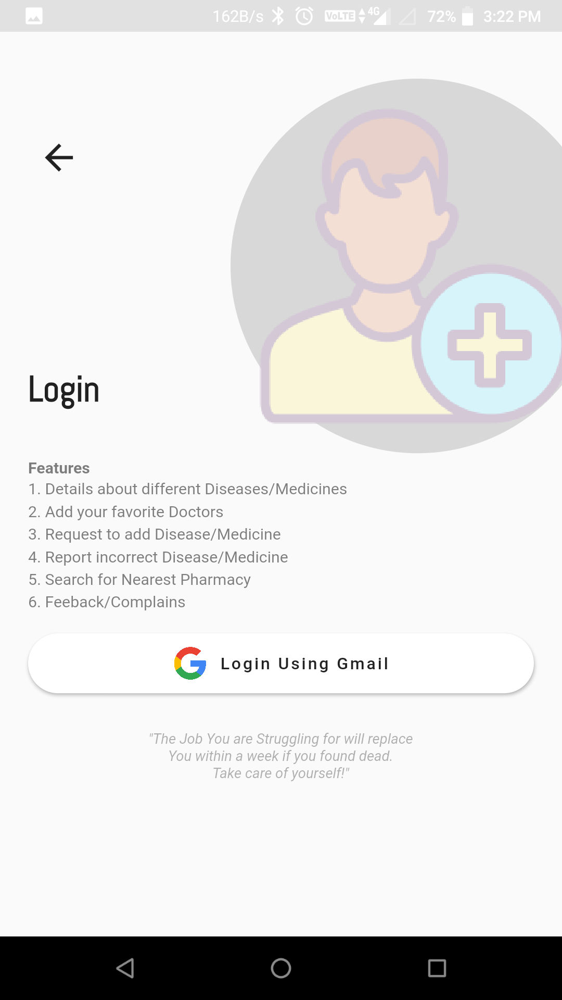 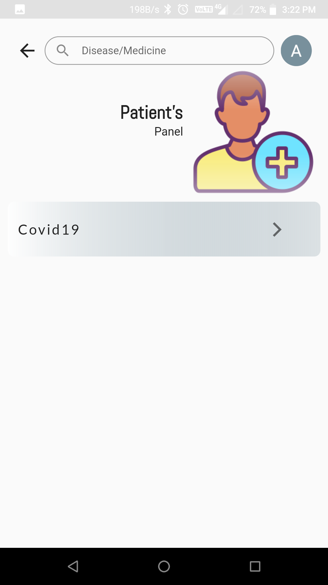 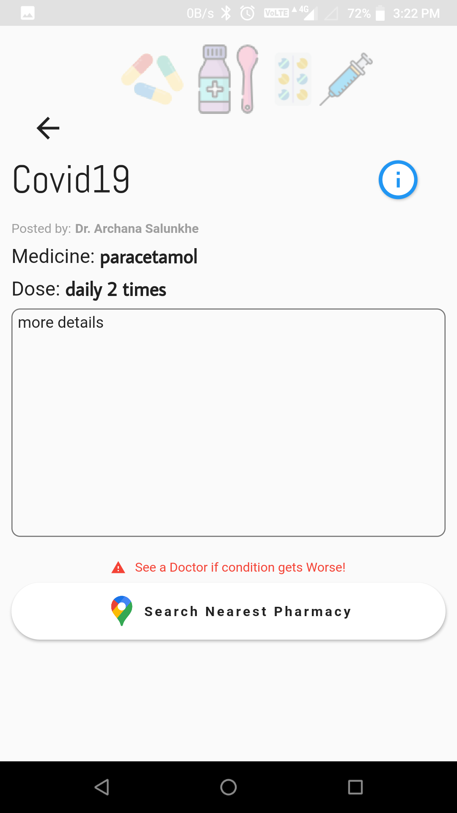 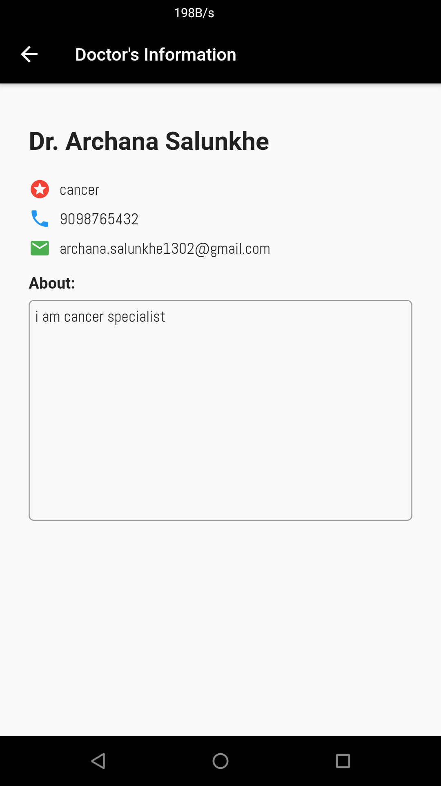 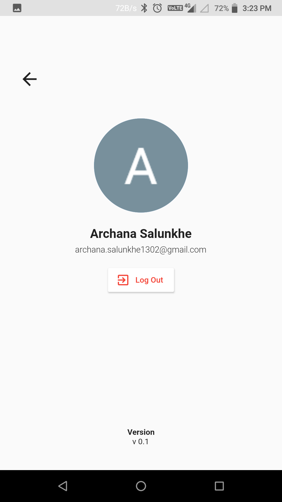

# Features in Future
Following features could be added in future:

1. Doctor and Patient panel's could be separted in two apps.

2. Doctor can only edit or delete the medicine/disease which he/she has posted not anyone else's.

3. Patient can request to add new medicine/disease.

4. Chat feature between Doctor and Patient for discussion.